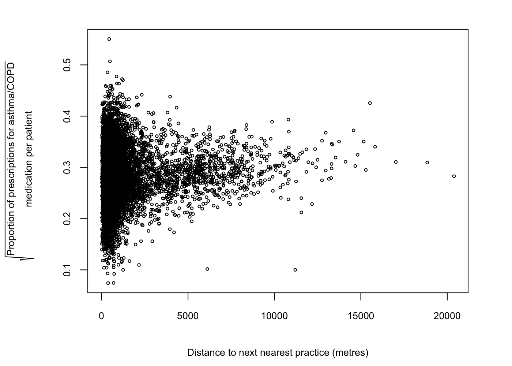

Respiratory disease and urban areas (England)
================
Daniel Delbarre
5/3/2018

Project introduction
====================

Chronic respiratory diseases are relatively common in the UK. According to the British Lung Foundation, in the UK [8 million people have asthama](https://statistics.blf.org.uk/asthma) and [1.2 million people have chronic obstructive pulmonary disease (COPD)](https://statistics.blf.org.uk/copd), with numbers increasing.

We are constantly hearing about climate change, pollution and the environment in the news -- and the effect that these things can have on our health. Elevated pollution levels can cause and exacerbate chronic respiratory diseases ([Asthma UK](https://www.asthma.org.uk/advice/triggers/pollution/); [Paulin and Hansel, 2016](https://www.ncbi.nlm.nih.gov/pmc/articles/PMC4765726/)), so we might expect to find an increased prevalence of these diseases where there are elevated levels of pollution. Urban areas, particulary cities, can contain higher levels of pollutants that contibute to respiratory diseases ([Jiang et al., 2016](https://www.ncbi.nlm.nih.gov/pmc/articles/PMC4740163/)).

Using publicily available data from the National Health Service (NHS), I am going to investigate the relationship between urban areas and the prevalence of chronic respiratory disease in England. I am going to investigate this at the practice level, using the number of prescriptions issued for asthma/COPD as in indicator of the prevalence of these diseases.

Data retrieval and initial processing (MySQL)
=============================================

I am going to use three datasets, all of which are available from the [UK government's public data repository](https://data.gov.uk). The data I will be using is from November 2017 -- the more recently available data. The three data sets I will use are as follows:

-   [List of medical practices in England and Wales](https://data.gov.uk/dataset/england-nhs-connecting-for-health-organisation-data-service-data-files-of-general-medical-practices)
-   [Number of patients registered at each medical practice, November 2017](https://data.gov.uk/dataset/numbers_of_patients_registered_at_a_gp_practice/resource/75ef591b-a8b9-4c54-af0a-b7730b745a8f)
-   [List and quantities of medications prescribed by every medical practice, November 2017 (warning: large file)](https://data.gov.uk/dataset/prescribing-by-gp-practice-presentation-level/resource/2d930db5-c1ff-49da-bdee-4d1fb26cde11)

To start with I am going to build a datbase that I will use to bring all of this data together, and then generate queries.

``` sql
CREATE DATABASE nhs;
USE nhs;
```

The first table I am going to create will hold details of all of the patients currently registered to NHS practices and hospitals.

``` sql
CREATE TABLE gp_patients (
    id INTEGER PRIMARY KEY AUTO_INCREMENT,
    org_type VARCHAR(100),
    org_code VARCHAR(20),
    postcode VARCHAR(15),
    sex VARCHAR(10),
    age VARCHAR(10),
    no_patients INTEGER);

LOAD DATA LOCAL INFILE '/XXX/gp-reg-pat-prac-quin-age-nov-17.csv'
    INTO TABLE gp_patients
    FIELDS TERMINATED BY ','
    OPTIONALLY ENCLOSED BY '"'
    LINES TERMINATED BY '\r\n'
    IGNORE 1 LINES
    (@dummy, @dummy, org_type, org_code, @dummy, postcode, sex, age, no_patients);
```

The next table will contain some more detailed information about the practices. I only really need one piece of information, which is the status of the practice (as some may practices have closed down but they could still be issuing old prescriptions).

``` sql
CREATE TABLE practices (
    id INTEGER PRIMARY KEY AUTO_INCREMENT,
    surgery_code VARCHAR(20),
    surgery_status VARCHAR(5));

LOAD DATA LOCAL INFILE '/XXX/epraccur/epraccur.csv'
    INTO TABLE practices
    FIELDS TERMINATED BY ','
    OPTIONALLY ENCLOSED BY '"'
    LINES TERMINATED BY '\r\n'
    (surgery_code, @dummy, @dummy, @dummy, @dummy, @dummy, @dummy, @dummy, @dummy, @dummy, @dummy, @dummy,
    surgery_status, @dummy, @dummy, @dummy, @dummy, @dummy, @dummy, @dummy, @dummy, @dummy, @dummy,
    @dummy, @dummy, @dummy, @dummy);
```

The final table I am going to create will contain all of the prescriptions issued by every NHS practice during November 2017.

``` sql
CREATE TABLE prescriptions (
    id INTEGER PRIMARY KEY AUTO_INCREMENT,
    practice_code VARCHAR(20),
    bnf_code VARCHAR(30),
    medication_name VARCHAR(200),
    no_items INTEGER,
    actual_item_cost DECIMAL (8,2),
    quant_items INTEGER);

LOAD DATA LOCAL INFILE '/XXX/T201711PDPI+BNFT.CSV'
    INTO TABLE prescriptions
    FIELDS TERMINATED BY','
    OPTIONALLY ENCLOSED BY '"'
    LINES TERMINATED BY '\r\n'
    IGNORE 1 lines
    (@dummy, @dummy, practice_code, bnf_code, medication_name, no_items, @dummy, actual_item_cost,
    quant_items, @dummy, @dummy);
```

As I am looking into the usage of asthma/COPD medications, all of the other medications in the `prescriptions` table are not going to be too helpful here. Rather than having to text mine the names of over 20000 medications, there is an easy way of identifying the medications that I am interested in. Each drug has a British National Formularly (BNF) code; its digits can be used to identify the type of drug. Codes starting with '03' are respiratory medications. The next two digits represent subcategories of respiratory medication. I am going to use: '01' (bronchodilators), '02' (corticosteroids) and '03'(cromoglicate and related therapy and leukotriene receptor antagonists). Any BNF code beginning with '0301', '0302' or '0303' will be a drug used to treat respiratory diseases like asthma and COPD. The query below identifies these drugs and will be used again in other queries below.

``` sql
SELECT bnf_code, medication_name 
    FROM prescriptions 
    WHERE 
        ((bnf_code LIKE '0301%') OR 
      (bnf_code LIKE '0302%') OR 
      (bnf_code LIKE '0303%')) 
    GROUP BY bnf_code, medication_name;
```

Now I'm going to generate a query to pull together the data that I will need for the project:

-   Practice code (to identify each practice)
-   Practice postcode (for geocoding)
-   Number of registered patients (total)
-   Sum of all prescriptions issued in November 2017
-   Sum of all asthma/COPD prescriptions issued in November 2017
-   The proportion of prescriptions issued per patient (for error identification)
-   The proportion of prescriptions that were for asthma/COPD medications issued per patient.

Due to the large amount of data (10 million rows in the `prescriptions` table) I have used subqueries to improve efficiency. Each row will contain the data for each practice.

``` sql
SELECT a.practice_code, postcode, no_patients, a.sum_all, b.sum_inh, a.sum_all/no_patients AS presc_per_pat, b.sum_inh/no_patients AS inh_presc_per_pat
    FROM (SELECT practice_code, SUM(no_items) AS sum_all 
        FROM prescriptions 
        GROUP BY practice_code) AS a
    INNER JOIN gp_patients ON gp_patients.org_code = a.practice_code
    INNER JOIN practices ON practices.surgery_code = a.practice_code
    INNER JOIN (SELECT practice_code, SUM(no_items) AS sum_inh 
        FROM prescriptions
        WHERE ((bnf_code LIKE '0301%') OR 
                (bnf_code LIKE '0302%') OR 
                (bnf_code LIKE '0303%')) 
        GROUP BY practice_code) AS b ON b.practice_code = a.practice_code 
    WHERE sex = "ALL" AND age = "ALL" AND org_type = "GP" AND surgery_status = "A"
    GROUP BY a.practice_code, postcode, no_patients
    LIMIT 0,10000;
```

Data cleaning, analysis and visualisation (R)
=============================================

``` r
library(ggmap)
library(ggplot2)
library(geosphere)
library(raster)
library(rgeos)
library(rgdal)
library(ggplot2)
par(cex = 0.5, cex.axis = 0.8, mar = c(5, 6, 2, 3), cex.lab = 0.8, mgp = c(3.5,1,0))
```

Import the exported results from the SQL query and view the data. First I'll look at the proportion of prescriptions per patient at each practice to see if there are any outliers.

``` r
nhs_data <- read.csv(file = "nhs_inhaler_data.csv", stringsAsFactors = FALSE)
summary(nhs_data)
```

    ##  practice_code        postcode          no_patients       sum_all      
    ##  Length:7194        Length:7194        Min.   :    4   Min.   :    19  
    ##  Class :character   Class :character   1st Qu.: 4525   1st Qu.:  6673  
    ##  Mode  :character   Mode  :character   Median : 7209   Median : 10931  
    ##                                        Mean   : 8136   Mean   : 12863  
    ##                                        3rd Qu.:10616   3rd Qu.: 17000  
    ##                                        Max.   :72279   Max.   :114392  
    ##     sum_inh       presc_per_pat      inh_presc_per_pat 
    ##  Min.   :   1.0   Min.   :  0.0042   Min.   : 0.00030  
    ##  1st Qu.: 332.0   1st Qu.:  1.2467   1st Qu.: 0.05990  
    ##  Median : 553.0   Median :  1.5976   Median : 0.07990  
    ##  Mean   : 655.2   Mean   :  1.7098   Mean   : 0.08534  
    ##  3rd Qu.: 865.0   3rd Qu.:  1.9652   3rd Qu.: 0.10350  
    ##  Max.   :7293.0   Max.   :323.0000   Max.   :10.50000

``` r
par(mfrow = c(1,2))
boxplot(nhs_data$presc_per_pat, cex = 0.8, pch = 20, frame = FALSE, ylab = "Prescriptions per patient")
hist(nhs_data$presc_per_pat, breaks = 15, col = "red", xlab = "Prescriptions per patient", main = NULL)
```


Something is not right here -- the data is highly skewed. My guess is that the extreme values which are skewing the data (i.e. &gt; 150 prescriptions per patients) are from the practices with very small patient numbers. These practices do not seem to be your typical GP practice and might need to be removed from the dataset.

``` r
nhs_data[which(nhs_data$presc_per_pat > 150),]
```

    ##      practice_code postcode no_patients sum_all sum_inh presc_per_pat
    ## 6991        Y02045 SK11 6JL           6    1048       1      174.6667
    ## 7099        Y02873  BS2 8JP           4    1292      42      323.0000
    ##      inh_presc_per_pat
    ## 6991            0.1667
    ## 7099           10.5000

Yes, this seems to be correct. I'm going to remove any practices with less than 100 patients from the data set and have another look at the distributions.

``` r
nhs_data2 <- nhs_data[-which(nhs_data$no_patients < 100),]
boxplot(nhs_data2$presc_per_pat, cex = 0.8, pch = 20, ylab = "Prescriptions per patient", frame = FALSE)
hist(nhs_data2$presc_per_pat, breaks = 15, main = NULL, col = "red", xlab = "Prescriptions per patient")
```


This is better but there are still a lot of practices prescribing a large number of prescriptions per patient -- some practices are issuing enough prescriptions for each patient to have 22 a month -- while some others are hardly issuing any precriptions (e.g. 0.4% of patients received a prescription at one practice). Maybe some GPs were closed for part of the month, or have an on-site clinic that issues prescriptions for non-registered patients. These practices are atypical and are going to distort the dataset. I'm going to use a method called Tukey's Fences, which detects outliers using quantiles and the interquartile range:

*Q*1 − *k*(*Q*3 − *Q*1)
 and
*Q*3 + *k*(*Q*3 − *Q*1)
 where *k* is a nonnegative constant. *k* = 1.5 (mild outlier), *k* = 3 (major outlier).

``` r
quants <- quantile(nhs_data2$presc_per_pat, c(0.25, 0.75))
iqr <- unname(quants[2] - quants[1])
mild.low <- quants[1] - (1.5 * iqr)
mild.high <- quants[2] + (1.5 * iqr)
major.low <- quants[1] - (3 * iqr)
major.high <- quants[2] + (3 * iqr)

mild_outliers <- nhs_data2[which(nhs_data2$presc_per_pat < mild.low | nhs_data2$presc_per_pat > mild.high),]
head(mild_outliers[order(mild_outliers$presc_per_pat),])
```

    ##      practice_code postcode no_patients sum_all sum_inh presc_per_pat
    ## 6161        N84010  L31 0DJ        4496      19       2        0.0042
    ## 7183        Y05346  S80 2TR        3606      82       1        0.0227
    ## 2953        F85053  N13 4RG        7306     198       2        0.0271
    ## 2762        F83051  N19 5EW        3957     125       7        0.0316
    ## 6427        P81740  PR6 9NW        1844      95       1        0.0515
    ## 7191        Y05569 SY13 1NT        3296     184       1        0.0558
    ##      inh_presc_per_pat
    ## 6161            0.0004
    ## 7183            0.0003
    ## 2953            0.0003
    ## 2762            0.0018
    ## 6427            0.0005
    ## 7191            0.0003

``` r
tail(mild_outliers[order(mild_outliers$presc_per_pat),])
```

    ##      practice_code postcode no_patients sum_all sum_inh presc_per_pat
    ## 4000        H85691 SW12 8NB         172    1719      24        9.9942
    ## 7046        Y02625   M5 4DG        1101   11024     385       10.0127
    ## 7189        Y05472  NR5 9BF         150    1879      61       12.5267
    ## 2406        E87711  SW3 4SR         298    4365     125       14.6477
    ## 6985        Y01924 CM21 0HH         110    1661      21       15.1000
    ## 7154        Y04786  IG3 8YB         449   10067     300       22.4209
    ##      inh_presc_per_pat
    ## 4000            0.1395
    ## 7046            0.3497
    ## 7189            0.4067
    ## 2406            0.4195
    ## 6985            0.1909
    ## 7154            0.6682

``` r
major_outliers <- nhs_data2[which(nhs_data2$presc_per_pat < major.low | nhs_data2$presc_per_pat > major.high),]
major_outliers[order(major_outliers$presc_per_pat),]
```

    ##      practice_code postcode no_patients sum_all sum_inh presc_per_pat
    ## 211         A83622  DH7 0BD        1649    7363     362        4.4651
    ## 6898        Y00243 WD18 0QN         577    2711      97        4.6984
    ## 1219        C83064 LN12 1DP       14084   66834    3221        4.7454
    ## 1248        C83650  LN8 5DA        3626   17428     835        4.8064
    ## 4948        L83673  EX4 6PD         559    2769     108        4.9535
    ## 225         A84006 NE66 2NL        8990   46909    1768        5.2179
    ## 2652        F81741 CO15 4TN        4773   28030    1544        5.8726
    ## 67          A81630  TS5 4EQ         758    5291     147        6.9802
    ## 6004        N81655  CH1 3EQ         390    2822     111        7.2359
    ## 7022        Y02509  WF1 2SN         182    1638      55        9.0000
    ## 6195        N84624  L31 0DJ         937    9112     372        9.7247
    ## 4000        H85691 SW12 8NB         172    1719      24        9.9942
    ## 7046        Y02625   M5 4DG        1101   11024     385       10.0127
    ## 7189        Y05472  NR5 9BF         150    1879      61       12.5267
    ## 2406        E87711  SW3 4SR         298    4365     125       14.6477
    ## 6985        Y01924 CM21 0HH         110    1661      21       15.1000
    ## 7154        Y04786  IG3 8YB         449   10067     300       22.4209
    ##      inh_presc_per_pat
    ## 211             0.2195
    ## 6898            0.1681
    ## 1219            0.2287
    ## 1248            0.2303
    ## 4948            0.1932
    ## 225             0.1967
    ## 2652            0.3235
    ## 67              0.1939
    ## 6004            0.2846
    ## 7022            0.3022
    ## 6195            0.3970
    ## 4000            0.1395
    ## 7046            0.3497
    ## 7189            0.4067
    ## 2406            0.4195
    ## 6985            0.1909
    ## 7154            0.6682

The major outliers option does not pick up any low low-prescribing practices (as the high-prescribing practices are more extreme than the low-prescribing), so I'm going to remove the mild outliers to try and normalise the dataset by removing the atypical practices.

``` r
nhs_data_corrected <- nhs_data2[- which(nhs_data2$presc_per_pat < mild.low | nhs_data2$presc_per_pat > mild.high),]
summary(nhs_data_corrected)
```

    ##  practice_code        postcode          no_patients       sum_all      
    ##  Length:7074        Length:7074        Min.   :  169   Min.   :   147  
    ##  Class :character   Class :character   1st Qu.: 4584   1st Qu.:  6752  
    ##  Mode  :character   Mode  :character   Median : 7261   Median : 10946  
    ##                                        Mean   : 8187   Mean   : 12874  
    ##                                        3rd Qu.:10648   3rd Qu.: 16992  
    ##                                        Max.   :72279   Max.   :114392  
    ##     sum_inh       presc_per_pat    inh_presc_per_pat
    ##  Min.   :   4.0   Min.   :0.1736   Min.   :0.00550  
    ##  1st Qu.: 336.0   1st Qu.:1.2453   1st Qu.:0.05990  
    ##  Median : 555.0   Median :1.5911   Median :0.07960  
    ##  Mean   : 656.7   Mean   :1.6034   Mean   :0.08274  
    ##  3rd Qu.: 867.0   3rd Qu.:1.9488   3rd Qu.:0.10230  
    ##  Max.   :7293.0   Max.   :3.0247   Max.   :0.30300

``` r
boxplot(nhs_data_corrected$presc_per_pat, cex = 0.8, pch = 20, frame = FALSE, ylab = "Prescriptions per patient")
hist(nhs_data_corrected$presc_per_pat, breaks = 15, main = NULL, col = "red", xlab = "Prescriptions per patient")
```


The distribution is now normal, with a much more realistic range of values. I'm now going to look at the number of prescriptions issued for asthma/COPD (as a proportion of the number of patients at each practice).

``` r
boxplot(nhs_data_corrected$inh_presc_per_pat, cex = 0.8, pch = 20, ylab = "Proportion of prescriptions for\n asthma/COPD medication\n per patient", frame = FALSE)
hist(nhs_data_corrected$inh_presc_per_pat, breaks = 15, main = NULL, col = "red", xlab = "Proportion of prescriptions for\n asthma/COPD medication\n per patient")
```


This data is positively skewed, with a few practices prescribing a larger number of prescriptions for asthma/COPD medication than the rest. A number of the downstream analyses I am going to perform will rely on the data being normally distributed, so I'm going to see if the distribution can be improved. First, I'll try log<sub>10</sub> and square root transformations.

``` r
hist(log10(nhs_data_corrected$inh_presc_per_pat), col = "red", breaks = 20, main = NULL, xlab = expression(atop(Log[10]~"proportion of prescriptions for"," asthma/COPD medication per patient")))
hist(sqrt(nhs_data_corrected$inh_presc_per_pat), col = "red", breaks = 20, main = NULL, xlab = expression(sqrt(atop("proportion of prescriptions for", " asthma/COPD medication per patient"))))
```


The square root transformation seems to do a good job, so I'll add a column with this transformed data to the data frame.

``` r
nhs_data_corrected$sqrt_inh_presc_per_pat <- sqrt(nhs_data_corrected$inh_presc_per_pat)
```

Is there a relationhip between prevalence of respiratory disease and how urban an area is?
------------------------------------------------------------------------------------------

I'm going to start by looking at whether more urban areas have higher proportions of prescriptions issued for asthma/COPD medication. I'm going to do this by using the distance between practices as a proxy for how rural or urban an area is. For example, in a city you would expect to find lots of practices in close proximity. First, I am going to need to get the coordinates for each practice.

I need to use geocoding (from the practice postcodes) to get the longitude and latitude coordinates. I am also going to record the area (e.g. city/region) where each practice is. I am going to use the `geocode` function from the ggmap package, and initially using the `source = "dsk"` (Data Science Toolkit) setting as the `"google"` source only allows 2,500 requests per day. When the api struggles to find the correct location they are all given the same coordinates (-2.6953100, 54.75844), so I will use this to identify problematic points. Note: the `"dsk"` server can be tempramental, so it may be necessary to rerun the loop from where it stopped if this happens.

``` r
nhs_data_corrected$lon <- NA
nhs_data_corrected$lat <- NA
nhs_data_corrected$area <- NA
for (i in 1:nrow(nhs_data_corrected)) {
  a = geocode(paste(location = nhs_data_corrected[i,2], ", UK", sep = ""),source = "dsk", output = "all")
  if (a$status == "ZERO_RESULTS") {
    nhs_data_corrected[i,10] <- "ERROR"
  }
  else {
    nhs_data_corrected[i,8] <- a$results[[1]]$geometry$location$lng
    nhs_data_corrected[i,9] <- a$results[[1]]$geometry$location$lat
    if (nhs_data_corrected[i,8] != -2.6953100 & nhs_data_corrected[i,9] != 54.75844) {
      nhs_data_corrected[i,10] <- a$results[[1]]$address_components[[2]]$short_name
    }
    else {
      nhs_data_corrected[i,10] <- "Unknown"
    }
  }
}
```

Some locations were not found using the `"dsk"` source, so I will use the `"google"` source to find the rest.

``` r
register_google("XXX") #Insert google API key here; easily obtained from google
for (i in which(nhs_data_corrected$area == "Unknown")) {
  a = geocode(paste(location = nhs_data_corrected[i,2], ", UK", sep = ""),source = "google", output = "all")
  if (a$status == "ZERO_RESULTS") {
    nhs_data_corrected[i,10] <- "ERROR"
  } else {
    nhs_data_corrected[i,8] <- a$results[[1]]$geometry$location$lng
    nhs_data_corrected[i,9] <- a$results[[1]]$geometry$location$lat
    if (nhs_data_corrected[i,8] != -2.6953100 & nhs_data_corrected[i,9] != 54.75844) {
      nhs_data_corrected[i,10] <- a$results[[1]]$address_components[[2]]$short_name
    } else {
      nhs_data_corrected[i,10] <- "Unknown"
    }
  }
}
```

Now I'll check which practices are still unknown or classified as errors.

``` r
nhs_data_corrected[which(nhs_data_corrected$area == "ERROR"),]
```

Practice "L81042" on row 4681 has an error. A google search for the practice shows that the postcode appears to be incorrect, so I'm going to correct it then rerun the api for this postcode.

``` r
nhs_data_corrected[4681,2] <- "BS37 4AA"
a = geocode(paste(location = nhs_data_corrected[4681,2], ", UK", sep = ""),source = "google", output = "all")
if (a$status == "ZERO_RESULTS") {
  nhs_data_corrected[4681,10] <- "ERROR"
} else {
  nhs_data_corrected[4681,8] <- a$results[[1]]$geometry$location$lng
  nhs_data_corrected[4681,9] <- a$results[[1]]$geometry$location$lat
  if (nhs_data_corrected[4681,8] != -2.6953100 & nhs_data_corrected[i,9] != 54.75844) {
    nhs_data_corrected[4681,10] <- a$results[[1]]$address_components[[2]]$short_name
  } else {
    nhs_data_corrected[4681,10] <- "Unknown"
  }
}
```

Now I'll check for any remaining errors.

``` r
nhs_data_corrected[which(nhs_data_corrected$area == "Unknown"),]
```

There is only 1 remaining error (not bad for over 7000 rows), which I'll correct manually.

``` r
nhs_data_corrected$area[which(nhs_data_corrected$practice_code == "Y05167")] <- "Doncaster"
```

To find the distance between each practice and the next nearest I will build a distance matrix that shows the distance between every practice in the dataset. I'll then work out the distance to the next nearest practice (that does not fall within the same postcode) for each practice.

``` r
practice_dist_mat <- distm(nhs_data_corrected[,9:10], fun = distHaversine)

pract_dist <- rep(NA, nrow(practice_dist_mat))
for (i in 1:nrow(practice_dist_mat)) {
  a = practice_dist_mat[order(practice_dist_mat[,i]),i]
  pract_dist[i] = a[-which(a == 0)][1]
}
par(mfrow = c(1,1))
plot(nhs_data_corrected$sqrt_inh_presc_per_pat ~ pract_dist, cex = 0.5, xlab = "Distance to next nearest practice (metres)", ylab = expression(sqrt(atop("proportion of prescriptions for asthma/COPD", "medication per patient"))))
```


One point seems to be extremely far away from all others. Let's take a look at what is going on with this point.

``` r
nhs_data_corrected[which.max(pract_dist),]
```

    ##      practice_code postcode no_patients sum_all sum_inh presc_per_pat
    ## 4700        L82017 TR21 0HE        2344    3681     153        1.5704
    ##      inh_presc_per_pat sqrt_inh_presc_per_pat       lon      lat
    ## 4700        0.06527304              0.2554859 -6.308046 49.91201
    ##                 area
    ## 4700 Isles of Scilly

The practice is on the Isles of Scilly, which explains why it is so far away from all other practices. As it is so far away from all other points (because of the geographic distance between it and the mainland) it makes sense to remove this point from the dataset. I'll make a dataframe containing the information that I'll be using here, and with the Isles of Scilly practice removed.

``` r
pract_dist_df <- data.frame(dist = pract_dist, sqrt_prop_inh_presc = nhs_data_corrected$sqrt_inh_presc_per_pat)[-which.max(pract_dist),]
par(mfrow = c(1,1))
plot(pract_dist_df, cex = 0.5, xlab = "Distance to next nearest practice (metres)", ylab = expression(sqrt(atop("proportion of prescriptions for asthma/COPD", "medication per patient"))))
```



This is better but the dataset is still highly skewed, and there may be some problems with heteroscedasticity. I'm going to try some different data transformations (to the distance) to see if the distribution of the data can be improved.

``` r
par(mfrow = c(1,2))
hist(log10(pract_dist_df$dist), breaks = 20, col = "red", xlab = expression(paste(Log[10], "distance to next nearest practice (metres)", sep = " ")), main = NULL)
hist(sqrt(pract_dist_df$dist), breaks = 20, col = "red", xlab = expression(sqrt("Distance to next nearest practice (metres)")), main = NULL)
```


Log scaling the data seems to do quite a good job of improving the distrbution, so I will stick with that. I'm going to run a linear regression to see if there is a relationship between the distance to the next nearest practice and the proportion of prescriptions for asthma/COPD medications.

``` r
pract_dist_lm <- lm(pract_dist_df$sqrt_prop_inh_presc ~ log10(pract_dist_df$dist))
summary(pract_dist_lm)
```

    ## 
    ## Call:
    ## lm(formula = pract_dist_df$sqrt_prop_inh_presc ~ log10(pract_dist_df$dist))
    ## 
    ## Residuals:
    ##       Min        1Q    Median        3Q       Max 
    ## -0.207013 -0.037669 -0.000819  0.037276  0.271186 
    ## 
    ## Coefficients:
    ##                           Estimate Std. Error t value Pr(>|t|)    
    ## (Intercept)               0.249895   0.003997  62.515  < 2e-16 ***
    ## log10(pract_dist_df$dist) 0.011122   0.001369   8.127 5.17e-16 ***
    ## ---
    ## Signif. codes:  0 '***' 0.001 '**' 0.01 '*' 0.05 '.' 0.1 ' ' 1
    ## 
    ## Residual standard error: 0.05689 on 7071 degrees of freedom
    ## Multiple R-squared:  0.009253,   Adjusted R-squared:  0.009113 
    ## F-statistic: 66.04 on 1 and 7071 DF,  p-value: 5.168e-16

``` r
par(mfrow = c(1,1))
plot(pract_dist_df$sqrt_prop_inh_presc ~ log10(pract_dist_df$dist), cex = 0.5, xlab = expression(paste(Log[10], " distance to next nearest practice (metres)", sep = " ")), ylab = expression(sqrt(atop("proportion of prescriptions for asthma/COPD", "medication per patient"))))
abline(pract_dist_lm, lwd = 2, col = "red")
```


Looking at the distribution of the data first, it looks like there wasn't a problem with heteroscedasticity after all - it was how the data close to 0 were compressed before transformation. Visually there does not appear to be a strong relationship between the two variables. In the linear regression analysis the slope of the regression seems to suggest the opposite to what I would have expected: more isolated practices issue greater numbers of prescriptions for asthma/COPD medication. However, the slope is quite low and there is a lot of error in this data, which is reflected in the R<sup>2</sup> statistic, which is very small (0.009).

This part of the analysis seems to suggest that the relationship between how the distance between practices and the prevalence of chronic respiratory disease is either non-existant or positive. Based on this, I think it would be quite interesting to visualise the proportion of prescriptions for asthma/COPD medication per practice on a map of England.

Mapping respiratory disease
---------------------------

I'm going to start by building the map. I'll get the base map using the `getData` function from the raster package and then plot using ggplot2. I'm getting maps for the UK and Ireland for visual completeness, although the prescription data is only from England. The maps are highly detailed and slow to plot, so I'm going to simplify them using `gsimplify`. How simple the map is will depend on the `tol` setting; experimenting with different values can be necessary to get a map containing an appropriate level of detail. Once the map has been plotted I will plot points for each practice, with the colour being indicative of the proportion of prescriptions that are for inhalers.

``` r
UK <- getData(name = "GADM", country = "United Kingdom", level = 1)
UK2 <- gSimplify(UK, tol=0.001, topologyPreserve=TRUE)
Ireland <- getData(name = "GADM", country = "Ireland", level = 0)
Ireland2 <- gSimplify(Ireland, tol=0.001, topologyPreserve=TRUE)

par(mfrow = c(1,1))
ggplot() +
  geom_polygon(data = UK2, aes(x = long, y = lat, group = group)) +
  geom_polygon(data = Ireland2, aes(x = long, y = lat, group = group)) +
  theme(axis.text = element_blank(), axis.line = element_blank(), axis.ticks = element_blank(), 
        panel.border = element_blank(), panel.grid = element_blank(), axis.title = element_blank(),
        legend.title.align=0.5, legend.title=element_text(size = rel(0.8))) +
  coord_cartesian(xlim = c(-5.6, 1.7), ylim = c(50.1, 55.5)) +
  geom_point(data = nhs_data_corrected, aes(x = lon, y = lat, color = sqrt_inh_presc_per_pat), 
             alpha = 0.5, 
             size = 0.8, stroke = 0) +
  scale_color_gradientn(colors = c("blue", "grey", "red"), 
                        values = scales::rescale(as.numeric(summary(nhs_data_corrected$sqrt_inh_presc_per_pat)[c(1:3, 5:6)]))) +
  labs(color = "Proportion of prescriptions\n issued for asthama or\n COPD medication\n per patient\n (square root transformed)")
```


This is quite interesting, and there seems to be some pattern to the data here.The clumps of data points represent large towns and cities. London, for example, has a high concentration of practices. However, the proportion of prescriptions for asthma/COPD medications seems to be quite low in London, which is not what I expected to find. The proportion of asthma/COPD prescriptions seems to be increasing towards the north of the country, so maybe there is some relationship between latitude and the proportion of prescriptions? Some rural areas also appear to have relatively high proportions of respiratory prescriptions (e.g East Anglia), so other factors may be having a considerable effect.

Is there a relationhip between latitude and the prevalence of respiratory disease?
----------------------------------------------------------------------------------

I am going to have a look at the relationship between proportion of prescriptions for asthma/COPD medication per patient and latitude. I'll start by producing a plot of this data.

``` r
plot(nhs_data_corrected$lat, nhs_data_corrected$sqrt_inh_presc_per_pat, cex = 0.5, xlab = "Latitude", ylab = expression(sqrt(atop("proportion of prescriptions for asthma/COPD", "medication per patient"))))
```


This is an interesting figure. The large clump of data around a latitude of 51.5 is approximately the same latitude as London, while the other clumps seem to correspond with other cities. I'm going to try and fit a regression model to this data to see if there is a relationship between latitude and respiratory illness. This relationship does not look linear, so I'm going to fit a polynomial regression model, which is more flexible, using a validation set approach to select the degree of polynomial by comparing test mean squared error (MSE).

``` r
set.seed(1)
train <- sample(nrow(nhs_data_corrected), 0.8 * nrow(nhs_data_corrected))
nhs_data_corrected.train <- nhs_data_corrected[train,]
nhs_data_corrected.test <- nhs_data_corrected[-train,]
test.error <- rep(NA, 20)
for (i in 1:20) {
  a = lm(sqrt_inh_presc_per_pat ~ poly(lat, i), data = nhs_data_corrected.train)
  b = predict(a, newdata = list(lat = nhs_data_corrected.test$lat), type = "response")
  test.error[i] <- mean((b - nhs_data_corrected.test$sqrt_inh_presc_per_pat)^2)
}
plot(1:length(test.error), test.error, xlab = "Degree of polynomial", ylab = "Test MSE")
```


After a polynomial of degree 14, there seems to be little benefit (reduction in Test MSE) with the addition of further terms, so I'm going to use that and apply it to the full dataset.

``` r
lat_inh_lm <- lm(sqrt_inh_presc_per_pat ~ poly(lat, 14), data = nhs_data_corrected)
x = seq(min(nhs_data_corrected$lat), max(nhs_data_corrected$lat), 0.05)
lat_inh_lm_pred <- predict(lat_inh_lm, newdata = list(lat = x), type = "response")
plot(nhs_data_corrected$lat, nhs_data_corrected$sqrt_inh_presc_per_pat, cex = 0.5, xlab = "Latitude", ylab = expression(sqrt(atop("proportion of prescriptions for asthma/COPD", "medication per patient"))))
lines(x, lat_inh_lm_pred, lwd = 2, col = "red")
```


This model appears to be overfitting at the extreme latitudes. The min/max stationary points looks like they may correspond with cities, although there seems to be a general increase in the proportion of prescriptions with increasing latitude. To look into this further I am going to try to work out what areas of the country have the highest/lowest levels of prescribing asthma/COPD medication.

What areas in England have the highest levels of respiratory disease?
---------------------------------------------------------------------

I'm going to build a new dataframe that contains the average latitude and average proportion of asthma/COPD medications for each major area (city/district) of England. I'm going to filter out any areas with less than 10 practices/data points as I am primarily interested in major regions, which also happen to have larger sample sizes.

``` r
places <- data.frame(place_names = unique(nhs_data_corrected$area), count = NA, avg_prop_inh_presc = NA, avg_lat = NA)
for (i in 1:nrow(places)) {
  a = which(nhs_data_corrected$area == places[i,1])
  places[i,2] <- length(a)
  places[i,3] <- mean(nhs_data_corrected$sqrt_inh_presc_per_pat[a])
  places[i,4] <- mean(nhs_data_corrected$lat[a])
}
places_filtered <- places[places$count >= 10,]
places_filtered <- places_filtered[order(places_filtered$avg_prop_inh_presc, decreasing = TRUE),]
```

Now that I've got the data together, I'm going to select and plot the top and bottom 25 areas in the country, as a barplot, with each bar shaded to represent the area's latitude. I'll use the `summary` function to help me calibrate my scales/axis lengths

``` r
summary(places_filtered$avg_prop_inh_presc)
```

    ##    Min. 1st Qu.  Median    Mean 3rd Qu.    Max. 
    ##  0.1852  0.2563  0.2836  0.2820  0.3120  0.3749

``` r
a <- summary(places_filtered$avg_lat)
ggplot(data = places_filtered[1:25,], aes(x = reorder(place_names, -avg_prop_inh_presc), y = avg_prop_inh_presc, fill = avg_lat)) +
  geom_bar(stat = 'identity') +
  scale_fill_gradientn(colours =  c("dodgerblue", "limegreen", "yellow", "darkorange", "red"), limits = a[c(1,6)]) +
  labs(y = expression(sqrt(atop("proportion of prescriptions for asthma/COPD", "medication per patient"))), fill = "Latitude") +
  scale_x_discrete(expand = c(0,0)) +
  scale_y_continuous(expand = c(0,0)) +
  coord_cartesian(ylim = c(0.15, 0.4)) +
  theme(axis.text.x = element_text(angle = 90, hjust = 1), axis.title.x = element_blank(), panel.grid = element_blank(), panel.background = element_blank())
```


``` r
median(places_filtered$avg_lat[1:25])
```

    ## [1] 53.5524

All but one of the 25 places with the highest prescription rate for asthma/COPD medications are in the middle to north of England, with a median latitude of 53.55. The majority of these areas are northern cities, with industrial heritage, although there are some agricultural areas too.

``` r
places_rows <- nrow(places_filtered)
ggplot(data = places_filtered[(places_rows-25):places_rows,], aes(x = reorder(place_names, -avg_prop_inh_presc), y = avg_prop_inh_presc, fill = avg_lat)) +
  geom_bar(stat = 'identity') +
  scale_fill_gradientn(colours =  c("dodgerblue", "limegreen", "yellow", "darkorange", "red"), limits = a[c(1,6)]) +
  labs(y = expression(sqrt(atop("proportion of prescriptions for asthma/COPD", "medication per patient"))), fill = "Latitude") +
  scale_x_discrete(expand = c(0,0)) +
  scale_y_continuous(expand = c(0,0)) +
  coord_cartesian(ylim = c(0.15, 0.4)) +
  theme(axis.text.x = element_text(angle = 90, hjust = 1), axis.title.x = element_blank(), panel.grid = element_blank(), panel.background = element_blank())
```


``` r
median(places_filtered$avg_lat[(places_rows-25):places_rows])
```

    ## [1] 51.50998

The 25 places with the lowest prescription rate for asthma/COPD medications are all (apart from Cambridge which is slightly further north) are around 51.5 degrees latitude. If you look at the names of these areas they are generally quite affluent areas, with a considerable number of them in London.

Summary
=======

-   When England is taken as a whole there is not a strong relationship between how urban an area is and the proportion of prescriptions that are issued for asthma/COPD medications per patient.
-   There is a lot of localised variation in the proportion of prescriptions that are issued for asthma/COPD medications per patient across different localities in England.
-   Generally, in northern areas of England, and in the larger cities in particular, more asthma/COPD medications are prescribed.
-   Areas of England where fewer medications for asthma/COPD are prescribed, typically seem to be affluent areas. Although this was not directly investigated here, the link between class and the type of work people undertake may have a more direct impact on the prevalence of chronic respiratory disease than pollution.
